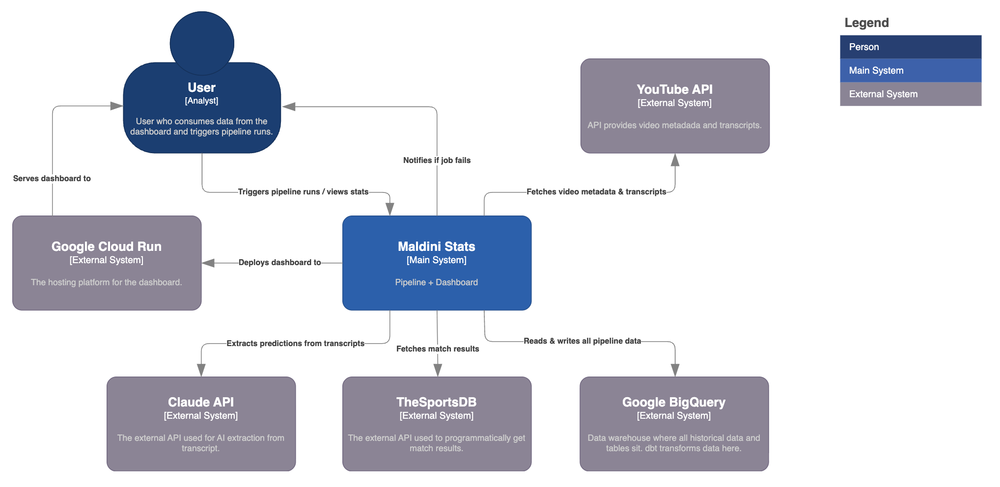

# Maldini Stats

## **Is Julio Maldonado ("Maldini") a superforecaster?**

Maldini is one of Spain's most prominent football journalists. Every week on his YouTube channel [@mundomaldini](https://www.youtube.com/@mundomaldini) he makes explicit, probabilistic predictions about upcoming matches. This project captures every prediction, scores it objectively with a [Brier score](https://en.wikipedia.org/wiki/Brier_score), and surfaces the answer in a live dashboard.

**→ [Live dashboard](https://maldini-stats-797074457864.us-central1.run.app/?lang=en)**


---

## The Question

A Brier score measures the accuracy of probabilistic predictions — **lower is better**, 0 is perfect.

| Benchmark | Brier Score |
|---|---|
| Naive baseline (guess 1/3 each outcome) | 0.222 |
| Typical football bookmaker | ~0.19 |
| **Superforecaster threshold** | **< 0.20** |
| Perfect forecaster | 0.00 |

Maldini earns the superforecaster badge only when his all-time average Brier score drops below 0.20 — and only once he has 100+ scored predictions for statistical reliability. The project currently tracks **1,400+ predictions** from 2022-Q4 onwards.

---

## Architecture



```
YouTube URL
    │
    ▼
ingest_transcripts.py          YouTube Data API v3 → video metadata
    │                          youtube-transcript-api → Spanish transcript
    ▼
raw.transcripts (BigQuery)     One row per video
    │
    ▼
extract_predictions.py         Claude Haiku reads transcript, extracts structured predictions
    │                          (home/away teams, competition, home/draw/away %)
    ▼
raw.predictions_extracted      One row per prediction (20 columns)
    │
    ▼
fetch_results.py               TheSportsDB API → actual match scorelines
    │                          Fuzzy team matching, 45-day window for undated predictions
    ▼
raw.match_results              One row per scored result
    │
    ▼
dbt (maldini_dbt/)             staging → intermediate → marts
    │                          Brier score computed here
    ▼
Dashboard (FastAPI + BigQuery) Served on Google Cloud Run
```

**BigQuery is the single source of truth.** All tables live in the `maldinia` GCP project. Raw tables are append-only — if transformation logic changes, fix the dbt SQL and re-run; the raw data is always intact.

Orchestration: **Dagster** — asset-based dependency graph, daily schedule at 08:00 UTC, inbox sensor that triggers the full pipeline when a new video CSV is dropped.

---

## dbt Models

```
staging/
  stg_transcripts              Clean video metadata
  stg_predictions              Typed, validated prediction rows
  stg_match_results            Normalised match scorelines

intermediate/
  int_predictions_with_legs    Explodes multi-leg predictions into individual rows
  int_predictions_matched      Joins predictions to match results

marts/
  fct_predictions              One row per prediction with Brier score
  mart_monthly_scores          Monthly rolling averages
  mart_competition_summary     Scores broken down by competition
  mart_scores_summary          All-time summary — feeds the dashboard headline
```

Brier score variants:
- **3-outcome** (home / draw / away) for regular matches
- **2-outcome** (home / away) for knockout matches where `pred_draw_pct = 0`

---

## Stack

| Layer | Technology |
|---|---|
| Orchestration | [Dagster](https://dagster.io) |
| Data warehouse | Google BigQuery |
| Transformations | dbt |
| Transcript ingestion | YouTube Data API v3, youtube-transcript-api |
| Prediction extraction | Anthropic Claude Haiku |
| Match results | TheSportsDB API |
| Dashboard | FastAPI + Jinja2, deployed on Google Cloud Run |

---

## How to Run Locally

### Prerequisites

```bash
git clone https://github.com/tomas-ravalli/maldini-stats.git
cd maldini-stats
python -m venv venv && source venv/bin/activate
pip install -r requirements.txt
cp .env.example .env   # fill in YOUTUBE_API_KEY and ANTHROPIC_API_KEY
gcloud auth application-default login
```

### Automated (Dagster)

```bash
dagster dev   # UI at http://localhost:3000
```

Drop a CSV with a `video_url` column into `data/inbox/` — the inbox sensor detects it within ~60s and runs the full pipeline automatically.

### Manual

```bash
# 1. Ingest transcript
python src/ingest/ingest_transcripts.py --file data/inbox/videos.csv

# 2. Extract predictions via Claude Haiku
python src/extractor/extract_predictions.py

# 3. Fetch match results from TheSportsDB
python src/results/fetch_results.py

# 4. Run dbt
cd maldini_dbt && dbt run
```

### Dashboard

```bash
uvicorn src.dashboard.web_app:app --reload   # http://localhost:8000
```

---

## Design Notes

- **Raw tables are immutable** — `WRITE_APPEND` only; fix the dbt SQL, not the source data.
- **No-draw handling** — when `pred_draw_pct == 0`, a 2-outcome Brier formula is applied automatically in `fct_predictions`.
- **Fuzzy team matching** — normalisation strips accents, common prefixes (`Real`, `Atlético`), and applies Spanish→English word substitutions before substring matching.
- **No-date window** — predictions without a `match_date` use a 45-day window from `publish_date` to find the matching fixture.
- **Dashboard cache** — BigQuery results cached for 10 minutes; refreshes automatically after `dbt run` with no redeploy needed.
- **Data scope** — 2022-Q4 onwards; earlier data excluded due to quality and availability.

---

## License

MIT
